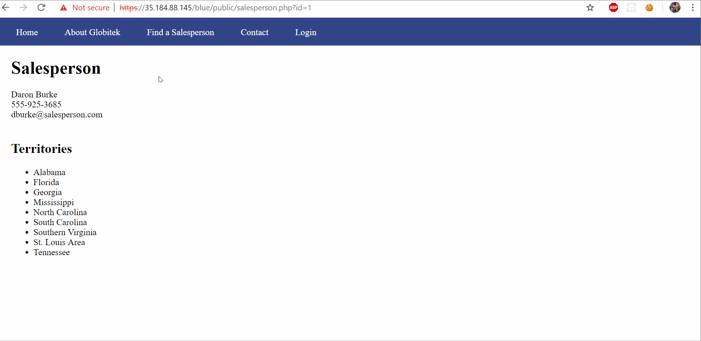
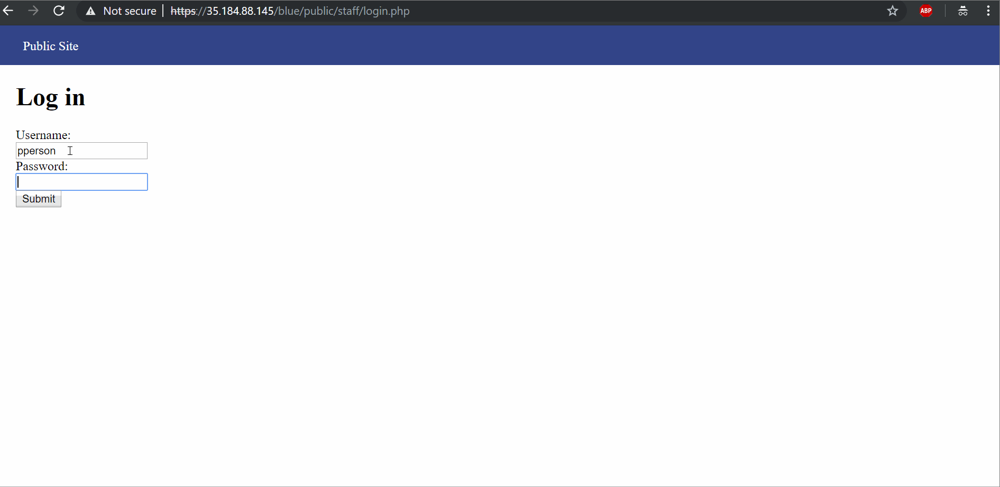
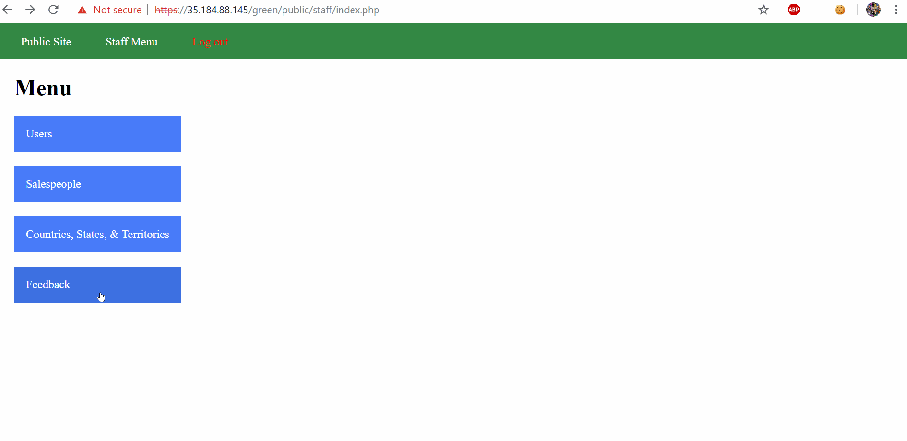
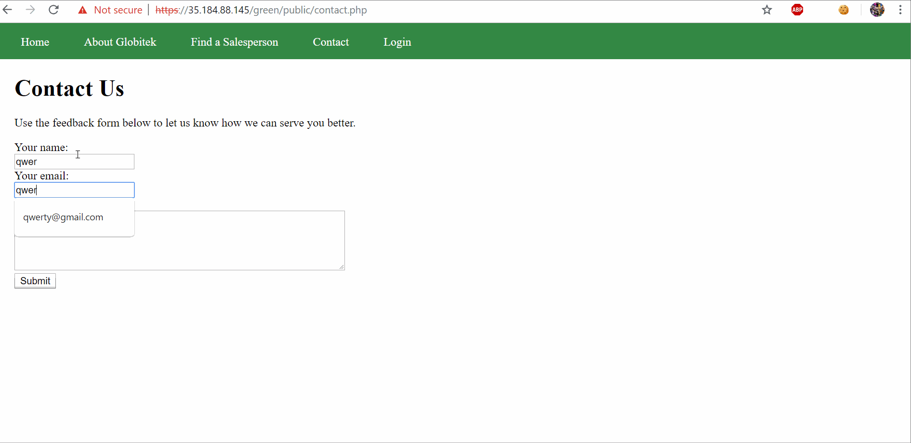

# Project 8 - Pentesting Live Targets

Time spent: **X** hours spent in total

> Objective: Identify vulnerabilities in three different versions of the Globitek website: blue, green, and red.

The six possible exploits are:
* Username Enumeration
* Insecure Direct Object Reference (IDOR)
* SQL Injection (SQLi)
* Cross-Site Scripting (XSS)
* Cross-Site Request Forgery (CSRF)
* Session Hijacking/Fixation

Each version of the site has been given two of the six vulnerabilities. (In other words, all six of the exploits should be assignable to one of the sites.)

## Blue

# Vulnerability #1: SQL Injection
	Summary: The query parameter "id" is vulnerable to SQL injection. Injecting a simple `'or'1'='1'#` query into id results in a database query error.
	

# Vulnerability #2: Session Hijacking
	Summary: Changing the session ID of a browser that is not signed in to a session ID of one that is signed in will log us in the account.
	

## Green

# Vulnerability #1: User Enumeration
	Summary: Existing usernames with incorrect passwords results in a bold message while invalid usernames does not produce a bold message.
	

# Vulnerability #2: Cross-Site Scripting
	Summary: A XSS vulnerability can be exploited by injecting a script such as `` in the contact form. Any users who then visits feedback will be greeted an alert.
	

## Red

# Vulnerability #1: Insecure Direct Object Reference
	Summary: On the salespersons page, the query parameter "id" can be referenced directly. `35.184.88.145/red/public/salesperson.php?id=10` shows a private salesperson's information.
	

# Vulnerability #2: Cross-Site Request Forgery
	Summary: The Red target accepts any CSRF token. A website can be written and along with an iframe can be injected into a form. Then a logged in user can visit the feedback page and trigger the iframe which will then cause the webpage to submit a form to change a salesperson's information. 
	

## Notes

Describe any challenges encountered while doing the work
